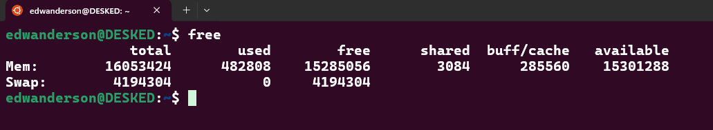

# 🐧 Linux - Lista de Comandos

Se você, assim como eu, usa **Linux** no dia a dia, sabe o quanto é útil ter uma **lista de comandos** sempre à mão.

Pensando nisso, reuni aqui os **comandos mais utilizados** para facilitar a busca e otimizar o tempo, sem precisar pesquisar algo que já usei antes.

Além de ser uma forma prática de consulta, essa lista me ajuda a **entender melhor cada comando** com minhas próprias palavras, fixando o conhecimento e **evoluindo constantemente** no universo do código aberto.

💡 **Sempre há algo novo para aprender!**

Bem-vindo ao mundo dos **comandos Linux**! 👨‍💻

**Boas descobertas!** 😉

---

### **1.0 Kernel e Sistema Operacional**

| **💻 Comando**                 | **📂 Contexto**               | **📝 Descrição**                                              | **🔍 Exemplo de Uso**        |
| :----------------------------- | :----------------------------  | :------------------------------------------------------------ | :--------------------------- |
| `man nome-do-comando`          | Documentação                  | Exibe o manual do comando que está sendo solicitado            | `man sudo`                  |
| `uname`                        | Gestão                        | Exibe apenas o nome do kernel do sistema operacional           | `uname` |
| `uname -s`                     | Gestão                        | Exibe o nome do kernel do sistema operacional.                 | `Linux`                     |
| `uname -n`                     | Gestão                        | Mostra o nome da máquina na rede.                              | `DESKED`                    |
| `uname -r`                     | Gestão                        | Exibe a versão exata (release) do kernel do sistema operacional. | `5.15.167.4-microsoft-standard-WSL2` |
| `uname -v`                     | Gestão                        | Exibe a versão do kernel junto com a data de compilação.       | `#1 SMP Tue Nov 5 00:21:55 UTC 2024` |
| `uname -m`                     | Gestão                        | Retorna a arquitetura do sistema                               | `x86_64`                    |
| `uname -p`                     | Gestão                        | Mostra o tipo de processador em uso (se disponível).           | `x86_64`                    |
| `uname -i`                     | Gestão                        | Retorna a plataforma do hardware (nem sempre disponível).     | `x86_64`                    |
| `uname -o`                     | Gestão                        | Exibe o nome do sistema operacional em execução.               | `GNU/Linux`                 |
| `uname -a`                     | Gestão                        | Mostra todas as informações acima em uma única saída.         | `Linux DESKED 5.15.167.4-microsoft-standard-WSL2 #1 SMP Tue Nov 5 00:21:55 UTC 2024 x86_64 x86_64 x86_64 GNU/Linux` |
| `clear`                        | Terminal                      | Limpa a tela do terminal, removendo todos os comandos e saídas anteriores, deixando o terminal em branco. | `clear`  |
| `sudo`                         | Permissionamento              | Utilizado para realizar execuções com permissões administrativas (ao executar será solicitado a senha do seu usuário atual) | `sudo apt update`  |
| `who`                          | Gestão                        | Exibe uma lista dos usuários que estão atualmente logados no sistema, mostrando o nome de usuário, terminal, horário de login e, em alguns casos, o endereço IP ou nome da máquina de origem. | `edwanderson pts/1        2025-03-04 20:59` |
| `free`                         | Gestão                        | Exibe informações sobre o uso da memória no sistema, mostrando dados de memória RAM, memória SWAP. Ele é útil para saber quanto de memória está sendo usada, quanto está livre e outras informações importantes sobre o consumo de recursos do sistema. |  |
| `shutdown`                     | Gestão                        | Executa o desligamento do sistema operacional                  | `shutdown` |
| `shutdown -r`                  | Gestão                        | Executa a reinicialização do sistema operacional               | `shutdown -r` |
| `shutdown -r now`              | Gestão                        | Executa a reinicialização do sistema operacional naquele momento | `shutdown -r now` |

### **1.1 inicialização de um sistema**

| **💻 Comando**   | **📂 Contexto**              | **📝 Descrição**   | **🔍 Exemplo de Uso**     |
| :---              | :----                        | :---                | :---                      |
| `debootstrap jammy diretório`     | Instalação de Sistema    | Utiliza o `debootstrap` para criar um sistema Debian (no caso do Jammy, o Ubuntu) básico dentro do diretório especificado. | `debootstrap jammy /container`  |

---

### **2. Arquivos e Diretórios**

| **💻 Comando**   | **📂 Contexto**              | **📝 Descrição**   | **🔍 Exemplo de Uso**     |
| :---              | :----                        | :---                | :---                      |
| `pwd` | Navegação | Exibe exatamente em qual diretório você está trabalhando | `/home/edwanderson` |
| `cd` | Navegação | Executa a navegação entre diretórios (Change Diretory) | `cd /home` para navegar até a pasta home. |
| `cd ..` | Navegação | Quando utilizado com dois pontos o mesmo navega ao diretório anterior, ou seja ele volta um diretório. | `cd ..` |
| `ls` | Diretórios e Arquivos | Exibe a lista de todos os diretórios e arquivos da pasta onde você está | `ls` |
| `ls -l` | Diretórios e Arquivos | Lista os arquivos e diretórios em formato detalhado, exibindo permissões, número de links, proprietário, grupo, tamanho, data de modificação e nome. | `ls -l` |
| `ls -a` | Diretórios e Arquivos | Lista todos os arquivos e diretórios, incluindo arquivos ocultos (os que começam com .). | `ls -a` |
| `ls -la` | Diretórios e Arquivos | Lista todos os arquivos e diretórios com detalhes completos, incluindo permissões, proprietário, tamanho e data de modificação. Também mostra os arquivos ocultos. | `ls -la` |
| `ls -lha` | Diretórios e Arquivos | Lista todos os arquivos, incluindo ocultos (-a), com detalhes completos (-l), e exibe os tamanhos de forma legível (-h, como KB, MB, GB). | `ls -lha` |
| `mkdir` | Diretórios | Cria um ou mais diretórios no sistema. | `mkdir novo_diretorio` → Cria um diretório chamado "novo_diretorio". |
| `mkdir -p` | Diretórios | Cria a estrutura de diretórios /pasta1/pasta2/pasta3. Se /pasta1 ou /pasta2 não existirem, o comando os cria automaticamente. | `mkdir -p pasta1/pasta2` → Cria `"pasta1"` e dentro dela `"pasta2"`, caso não existam. |
| `rm` | Diretórios e Arquivos | É utilizado para remover arquivos e diretórios. | `rm arquivo.txt` → Exclui o arquivo `arquivo.txt.` |
| `rm -rf` | Diretórios e Arquivos | Remove arquivos e diretórios, incluindo o conteúdo dentro deles, de forma recursiva e forçada, sem solicitar confirmação. | `rm -rf pasta/` → Exclui a pasta pasta e todos os arquivos e subdiretórios dentro dela, sem pedir confirmação |
| `cp` | Diretórios e Arquivos | É utilizado para copiar arquivos e diretórios de um local para outro. | `cp arquivo.txt /novo/local/` → Copia o arquivo arquivo.txt para o diretório `/novo/local/` |
| `mv` | Diretórios e Arquivos | É utilizado para mover ou renomear arquivos e diretórios. | `mv arquivo.txt /novo/local/` → Move o arquivo `arquivo.txt` para o diretório `/novo/local/` |
| `mv` | Diretórios e Arquivos | É utilizado para mover ou renomear arquivos e diretórios. | `mv arquivo_antigo.txt novo_nome.txt` → Renomeia o arquivo `arquivo_antigo.txt` para `novo_nome.txt` |
| `touch` | Arquivos | Cria um arquivo vazio ou atualiza a data e hora de modificação de um arquivo existente. | `touch novo_arquivo.txt` → Cria um arquivo vazio chamado `novo_arquivo.txt` |
| `cat` (abreviação de "concatenate") | Arquivos | Exibe o conteúdo de um arquivo, concatena múltiplos arquivos ou cria/edita arquivos. | `cat arquivo.txt` Exibe o conteúdo do arquivo `arquivo.txt` no terminal |
| `head` | Arquivos | Exibe as primeiras 10 linhas de um arquivo (por padrão) | `head arquivo.txt` → Mostra as primeiras 10 linhas do arquivo `arquivo.txt` |
| `head -n` | Arquivos | Exibe as primeiras n linhas de um arquivo, permitindo personalização. | `head -n 5 arquivo.txt` → Mostra as primeiras 5 linhas do arquivo `arquivo.txt` |
| `tail` | Arquivos | Exibe as últimas 10 linhas de um arquivo (por padrão). | `tail arquivo.txt` → Mostra as últimas 10 linhas do arquivo `arquivo.txt` |
| `tail -n` | Arquivos | Exibe as primeiras n linhas de um arquivo, permitindo personalização. | `tail -n 5 arquivo.txt` → Mostra as últimas 5 linhas do arquivo `arquivo.txt` |
| `more` | Arquivos | Exibe o conteúdo de um arquivo de forma paginada, permitindo rolar o texto para visualizar partes maiores do arquivo. | `more arquivo.txt` → Exibe o conteúdo de `arquivo.txt` permitindo navegação com a barra de espaço ou tecla Enter. |
| `less` | Arquivos | Exibe o conteúdo de um arquivo de forma paginada, permitindo rolar para cima e para baixo, além de realizar buscas no texto. | `less arquivo.txt` → Exibe o conteúdo de `arquivo.txt` permitindo navegação com as setas, barra de espaço e busca com `/`, ou seja `/palavra` |
| `grep` | Arquivos | Busca por uma palavra ou padrão dentro de um arquivo ou saída de comando. | `grep erro log.txt` → Mostra todas as linhas do arquivo `log.txt` que contêm a palavra "erro" |
| `grep -i` | Arquivos |  Busca por uma palavra ou padrão dentro de um arquivo ou saída de comando, ignorando a diferença entre maiúsculas e minúsculas. | `grep -i erro log.txt` → Mostra todas as linhas do arquivo `log.txt` que contêm a palavra "erro", independentemente de estar escrito como "Erro", "ERRO" ou "erro" |
| `grep -r` | Arquivos | Busca recursivamente por uma palavra ou padrão dentro de arquivos em um diretório e subdiretórios. | `grep -r erro /var/logs/` → Mostra todas as ocorrências da palavra "erro" dentro de arquivos no diretório `/var/logs/` e seus subdiretórios. |
| `grep -v` | Arquivos | Exclui as linhas que contêm um padrão ou palavra especificada, exibindo apenas as linhas que não correspondem. | Mostra todas as linhas do arquivo `log.txt` que não contêm a palavra "erro". |

---

### **3. Gerenciamento de Disco**

| **💻 Comando**   | **📂 Contexto**              | **📝 Descrição**   | **🔍 Exemplo de Uso**     |
| :---              | :----                        | :---                | :---                      |
| `mount` | Disco | Monta um disco de armazenamento ou sistema de arquivos no Linux. Necessita de permissões de superusuário. | `sudo mount /dev/sda1 /mnt/hd` |
| `mount -t tipo_de_sistema_arquivos dispositivo_ponto_de_montagem` | Disco | Monta um disco de armazenamento com o tipo de sistema de arquivos especificado. Necessita de permissões de superusuário. | `sudo mount /dev/sda1 /mnt/hd` |
| `umount` | Disco | Remoção de disco virtual no Linux, para isso deve-se executar como superusuário, o disco que será desmontado não pode estar em utilização. | `sudo umount /mnt/hd` |
| `mount -t overlay -o lowerdir=<diretório-base>,upperdir=<diretório-de-mudanças>,workdir=<diretório-de-trabalho> overlay <ponto-de-montagem>` | Criação de camadas com overlay | Monta um sistema de arquivos `overlay`, combinando o conteúdo de múltiplas camadas (`lowerdir`, `upperdir` e `workdir`) em um único ponto de montagem. | `mount -t overlay -o lowerdir=/base,upperdir=/modificacoes,workdir=/trabalho overlay /mnt/overlay` |

---

### **4. Gerenciamento de Pacotes e Bibliotecas**

| **💻 Comando**   | **📂 Contexto**              | **📝 Descrição**   | **🔍 Exemplo de Uso**     |
| :---              | :----                        | :---                | :---                      |
| `apt update`| pacotes | Atualiza a lista de pacotes disponíveis nos repositórios configurados.| `sudo apt update`|
| `apt install htop`| Pacotes| Instala o pacote `htop`, uma ferramenta interativa para monitoramento de processos no Linux. | `sudo apt install htop`|
| `apt install debootstrap` | pacotes | Instala o pacote `debootstrap`, usado para criar sistemas Debian a partir do zero. | `sudo apt install debootstrap` |
| `ldd /bin/programa` | bibliotecas | Mostra as bibliotecas compartilhadas utilizadas por um programa.| `ldd /bin/bash`|

---

### **5. Isolamento de Ambientes com Namespaces (unshare)**

| **💻 Comando**   | **📂 Contexto**              | **📝 Descrição**   | **🔍 Exemplo de Uso**     |
| :---              | :----                        | :---                | :---                      |
| `unshare --pid --fork --mount-proc chroot . /bin/bash` | Namespaces         | Cria um novo namespace de processo (PID) isolado. O processo dentro desse shell terá PID 1, simulando um ambiente isolado. Além disso, o comando `chroot` muda a raiz do sistema de arquivos para o diretório especificado (`.`), criando uma nova hierarquia de diretórios para o processo. O `/proc` também é montado corretamente, permitindo o acesso aos dados do processo dentro do novo ambiente. | `unshare --pid --fork --mount-proc chroot . /bin/bash` |
| `unshare --pid --fork --mount-proc /bin/bash`        | Namespaces         | Cria um novo namespace de processo (PID) isolado e inicia um shell com o processo dentro desse novo ambiente. O processo terá PID 1 e o `/proc` será montado corretamente, permitindo o monitoramento dos processos no novo namespace. | `unshare --pid --fork --mount-proc /bin/bash`             |

---

### **6. Gerenciamento de permissões**

| **💻 Comando**   | **📂 Contexto**              | **📝 Descrição**   | **🔍 Exemplo de Uso**     |
| :---              | :----                        | :---                | :---                      |
| `chroot` | Permissionamento | O comando `chroot` altera a raiz do sistema para o diretório especificado, permitindo isolar o ambiente de execução. Com isso, é possível controlar o acesso a diferentes partes do sistema, sendo útil para segurança e testes em ambientes isolados. | `chroot /novo/diretorio` |
| `chroot` | Permissionamento |  | `chroot` |

---

### **7. Gerenciamento de Processos**

| **💻 Comando**   | **📂 Contexto**              | **📝 Descrição**   | **🔍 Exemplo de Uso**     |
| :---              | :----                        | :---                | :---                      |
| `ps` | category | description | `comand example` |
| `ps -aux` | category | description | `comand example` |
| `ps -ef` | category | description | `comand example` |

---

### **8. Gerenciamento de recursos**

| **💻 Comando**   | **📂 Contexto**              | **📝 Descrição**   | **🔍 Exemplo de Uso**     |
| :---              | :----                        | :---                | :---                      |
| `comand` | category | description | `comand example` |

---

### **7. xpto**

| **💻 Comando**   | **📂 Contexto**              | **📝 Descrição**   | **🔍 Exemplo de Uso**     |
| :---              | :----                        | :---                | :---                      |
| `comand` | category | description | `comand example` |