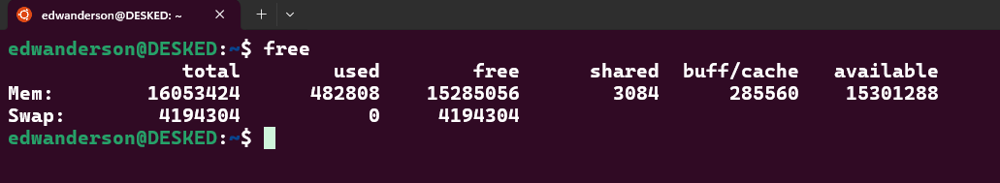

# 🐧 Linux - Lista de Comandos

Se você, assim como eu, usa **Linux** no dia a dia, sabe o quanto é útil ter uma **lista de comandos** sempre à mão.

Pensando nisso, reuni aqui os **comandos mais utilizados** para facilitar a busca e otimizar o tempo, sem precisar pesquisar algo que já usei antes.

Além de ser uma forma prática de consulta, essa lista me ajuda a **entender melhor cada comando** com minhas próprias palavras, fixando o conhecimento e **evoluindo constantemente** no universo do código aberto.

💡 **Sempre há algo novo para aprender!**

Bem-vindo ao mundo dos **comandos Linux**! 👨‍💻

**Boas descobertas!** 😉

---

## **🐧 Comandos do Linux**

### **1. Kernel e Sistema Operacional**

| **💻 Comando**   | **📂 Contexto**              | **📝 Descrição**   | **🔍 Exemplo de Uso**     |
| :---              | :----                        | :---                | :---                      |
| `uname` | Gestão | Exibe apenas o nome do kernel do sistema operacional | `Linux` e/ou `Darwin` e/ou `FreeBSD` |
| `uname -s` | Gestão | Exibe o nome do kernel do sistema operacional. | `Linux` |
| `uname -n` | Gestão | Mostra o nome da máquina na rede. | `DESKED` |
| `uname -r` | Gestão | Exibe a versão exata (release) do kernel do sistema operacional. | `5.15.167.4-microsoft-standard-WSL2` |
| `uname -v` | Gestão | Exibe a versão do kernel junto com a data de compilação. | `#1 SMP Tue Nov 5 00:21:55 UTC 2024` |
| `uname -m` | Gestão | Retorna a arquitetura do sistema | `x86_64` |
| `uname -p` | Gestão | Mostra o tipo de processador em uso (se disponível). | `x86_64` |
| `uname -i` | Gestão | Retorna a plataforma do hardware (nem sempre disponível). | `x86_64` |
| `uname -o` | Gestão | Exibe o nome do sistema operacional em execução. | `GNU/Linux` |
| `uname -a` | Gestão | Mostra todas as informações acima em uma única saída. | `Linux DESKED 5.15.167.4-microsoft-standard-WSL2 #1 SMP Tue Nov 5 00:21:55 UTC 2024 x86_64 x86_64 x86_64 GNU/Linux` |
| `clear` | Terminal | Limpa a tela do terminal, removendo todos os comandos e saídas anteriores, deixando o terminal em branco. | `clear`  |
| `sudo` | Permissionamento | É utilizado para realizar execuções com permissões administrativas (ao executar será solicitado a senha do seu usuario atual) | `sudo apt update`  |
| `who` | Gestão | Exibe uma lista dos usuários que estão atualmente logados no sistema, mostrando o nome de usuário, terminal, horário de login e, em alguns casos, o endereço IP ou nome da máquina de origem. | `edwanderson pts/1        2025-03-04 20:59` |
| `free` | Gestão | Exibi informacoes sobre o uso da memoria no sistema, mostrando dados de memoria RAM, memoria SWAP. Ele é útil para saber quanto de memória está sendo usada, quanto está livre e outras informações importantes sobre o consumo de recursos do sistema. |  |
| `shutdown` | Gestão | Executa o desligamento do sistema operacional | `shutdown` |
| `shutdown -r` | Gestão | Executa o reinicialização do sistema operacional | `shutdown -r` |
| `shutdown -r now` | Gestão | Executa a reinicialização do sistema operacional naquele momento | `shutdown -r now` |
| `man` | Documentação | Exibe o manual do comando que está sendo solicitado | `man sudo` |

---

| Comando ou Sintaxe | Contexto | Descrição | Exemplo/Uso de Caso |
| :---               | :----    | :---      | :---    |
| Comando ou sintaxe    | Contexto    | Descrição | Exemplo ou Conceito |
| service {subcomando} <nome do serviço> | Gerenciamento de Serviço | Utiliza-se o comando systemctl para esse tipo de serviço | Conceito |
| service --status-all | Gerenciamento de Serviço | Apresenta uma lista de todos os status que estão ativos ou inativos em seu Linux |  |
| systemctl {subcomando} <nome do serviço> | Gerenciamento de Serviço | Fornece uma maneira simples e eficaz de iniciar, interromper, reiniciar e monitorar os serviços no sistema. | Conceito |
| systemctl status <nome do serviço> | Gerenciamento de Serviço | Verificação de status do serviço httpd (apache) | systemctl status httpd.service |
| systemctl start <nome do serviço> | Gerenciamento de Serviço | Ativação do serviço httpd (apache) | systemctl start httpd.service |
| systemctl stop <nome do serviço> | Gerenciamento de Serviço | Interrompe o serviço httpd (apache) | systemctl stop httpd.service |
| systemctl status | Gerenciamento de Serviço | Apresenta a lista de todos os serviços em forma de cadeia, assim é possivel verificar os serviços e sub-serviços | Conceito |

| Comando ou Sintaxe | Contexto | Descrição | Exemplo/Uso de Caso |
| :---               | :----    | :---      | :---    |
| yum -y check-update   | Contexto    | Descrição | Exemplo ou Conceito |
| yum update --security    | Contexto    | Descrição | Exemplo ou Conceito |
| yum -y upgrade    | Contexto    | Descrição | Exemplo ou Conceito |
| yum install httpd -y   | Contexto    | Descrição | Exemplo ou Conceito |
| yum history list   | Contexto    | Descrição | Exemplo ou Conceito |
| yum history info <numero-do-ID-no-history-list>   | Contexto    | Descrição | Exemplo ou Conceito |
| clear   | Contexto    | Descrição | Exemplo ou Conceito |
| cd    | Contexto    | Descrição | Exemplo ou Conceito |
| ls    | Contexto    | Descrição | Exemplo ou Conceito |
| top | Gerenciamento de Serviço | Exibe os processos atualmente em execução, bem como o uso de recursos, como uso de CPU e uso de memória | Conceito |
| kill <numero-do-PID> | Gerenciamento de Serviço | Finaliza o processo no qual foi indicado o ID, é possivel coletar o PID executando o comando top | kill 2967 |
| pwd  | Contexto    | Descrição | Exemplo ou Conceito |
| curl  | Contexto    | Descrição | Exemplo ou Conceito |
| unzip | Contexto    | Descrição | Exemplo ou Conceito |
| tee   | Contexto    | Descrição | Exemplo ou Conceito |
| sort   | Contexto    | Descrição | Exemplo ou Conceito |
| find   | Contexto    | Descrição | Exemplo ou Conceito |
| cut   | Contexto    | Descrição | Exemplo ou Conceito |
| cat   | Contexto    | Descrição | Exemplo ou Conceito |
| sed   | Contexto    | Descrição | Exemplo ou Conceito |
| Alias {apelido-para-comando}='comando-que-receberá-apelido' | Shell Linux | Com este comando é possivel definir um apelido para um comando longo para um comando menor | alias lsf='ls -F' |
| Touch    | Contexto    | Descrição | Exemplo ou Conceito |
| chmod    | Contexto    | Descrição | Exemplo ou Conceito |
| vi    | Contexto    | Descrição | Exemplo ou Conceito |
| ls -a    | Contexto    | Descrição | Exemplo ou Conceito |
| ls   | Contexto    | Descrição | Exemplo ou Conceito |
| cp   | Contexto    | Descrição | Exemplo ou Conceito |
| echo   | Scripts Shell Linux | Imprime informações na console | echo 'apresentação desse texto na console' |

### Linux Daily

| Sintaxe  | Contexto | Descrição |
| :---    | :----    | :---    |
| su - <nome-do-usuario>   | gerencia    | troca de usuario |
| su - <nome-do-usuario>   | gerencia    | troca de usuario |

gerenciamento de usuarios
groups <nome-do-usuario> = verificar quais grupos estao configurados para este usuario.

gerenciamento de sistema operacional
sudo reboot = reinicializaçao do sistema operacional

